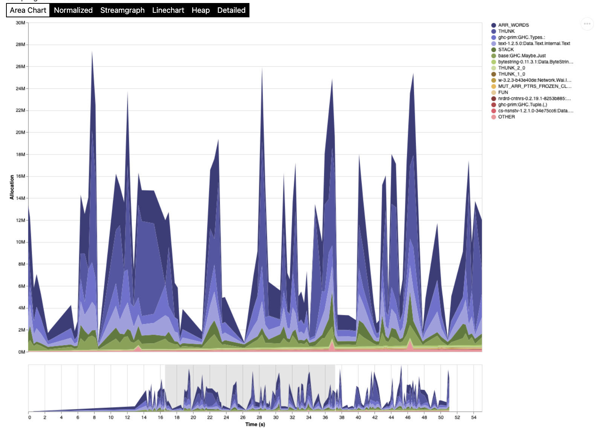

# Profiling Memory Usage With `eventlog2html` and `ghc-debug`

## Abstract

Understanding and analysing the memory usage of Haskell programs is a
notoriously difficult yet important problem. Recent improvements to GHC's
profiling capabilities, along with better tooling, has made it much easier to
deeply and precisely analyse the memory usage characteristics of even large
Haskell programs.

This workshop aims to present three such tools that allow high and low level
memory usage analysis of Haskell programs: `eventlog2html`, `nothunks`, and
`ghc-debug`. We will learn how to set up and use `eventlog2html` to generate
high-level visuals and statistics of our program's execution. We will also learn
how to set up and use `ghc-debug` to precisely and programmatically explore our
program's low-level memory usage profile.

We will examine these tools by using them on several pre-prepared Haskell
programs. The workshop aims to be beneficial to Haskell programmers of all
levels. Beginner Haskell programmers can expect to gain a deeper understanding
of lazy evaluation and the impacts it can have on program performance.
Experienced Haskell programmers can expect to gain an understanding of exactly
what these tools have to offer and the skills necessary to use these tools on
their own Haskell programs.

## Before The Workshop

Make sure you have the tools installed and built. You need to use GHC 9.2.4 or
greater. After that, in the root of this repository, run:
```
cabal build all
cabal install eventlog2html
cabal install ghc-debug-brick
```
And everything should be ready to go.

## Workshop Outline

### Goal

The primary goal of this workshop is for participants to gain experience and
familiarity with the `eventlog2html` and `ghc-debug` memory profiling tools, and
to observe how these tools complement one another in their features and use
cases.

### Prerequisites: Lazy Evaluation, Normal Forms, etc.

A crucial step towards understanding the memory usage of Haskell programs is
understanding Haskell's semantics as a lazy programming language. While thorough
coverage of such semantics is outside the scope of this workshop, I do hope that
much of what we cover will be approachable and enlightening to Haskell beginners
and experts alike.

### A First Look at `ghc-debug`

The `ghc-debug` style of debugging is, like Haskell, somewhat unique. In this
style, we have a *debuggee* and a *debugger*. The debuggee is the application
whose heap profile we would like to analyse. The debugger is the application
which will actually execute the analysis.

Communication between the debuggee and debugger happens over a socket, where the
debuggee simply responds to requests sent by the debugger. Crucially, it is
incredibly simple to turn a Haskell application into a debuggee for analysis
using `ghc-debug` debuggers, as we will see later.

With the above in mind, we can introduce `ghc-debug` as a set of libraries and
tools:

- [`ghc-debug-stub`](https://hackage.haskell.org/package/ghc-debug-stub): A
  library containing the functions you should include in your program to
  perform analysis with `ghc-debug` debuggers.
- [`ghc-debug-client`](https://hackage.haskell.org/package/ghc-debug-client): A
  library containing useful functions for writing your own heap analysis
  scripts.
- [`ghc-debug-brick`](https://hackage.haskell.org/package/ghc-debug-brick): An
  executable terminal user interface application that can connect to any
  debuggee.

These aren't all of the packages involved, but they are the big three that we
care about as users of `ghc-debug`.

To get started in the workshop, we will be examining the example `heap-shapes`
application as a debuggee using `ghc-debug-brick` as our debugger. This will
serve as an introduction to the `ghc-debug` style of debugging, and it will
cover some examples of evaluation scenarios that will be important later in the
workshop.

### The Haskell Is Obviously Better at Everything (HIOBE) Index

The HIOBE Index server (in `hiobe-index/server`) is the application we would
like to profile with the `eventlog2html`, `nothunks`, and `ghc-debug` tools. It
is a simple [scotty](https://hackage.haskell.org/package/scotty) web server
application that serves data from a sqlite database on various endpoints. The
database is already populated with over 70000 rows. We will generate fake
traffic for the application which will cause interesting objects to build up on
the heap.

For a full description of the HIOBE Index, see
[its README](./hiobe-index/README.md).

We will spend the rest of the workshop analysing, understanding, and tuning the
memory profile of the HIOBE Index server.

If you want to give it a try, run the server with:
```
cabal run hiobe-server
```
You should see the classic scotty `Setting phasers to stun...` output if
everything is okay.

Then run the traffic with:
```
cabal run hiobe-traffic
```
Some output should start scrolling by reporting various requests to the server.

#### Trying the `-s` flag

We know this program has bad space behavior, because I wanted it to. However, we
don't know how bad it is. We'll try to get a *very* high-level view of its
profile by using the `-s` RTS flag, which prints memory usage statistics on
program termination. This is usually a great place to start when profiling a
Haskell program's space usage.

In our case, we will find that the reported memory usage of the HIOBE server is
a little high. Indeed, if we run the application for longer or shorter periods
of time, the reported memory usage grows and shrinks! This indicates a
non-constant space complexity that we should probably be concerned about.

#### Using `eventlog2html`

We can dig deeper by having our program emit an
[eventlog](https://downloads.haskell.org/ghc/latest/docs/users_guide/runtime_control.html#rts-eventlog)
using the `-l` RTS option. However, to make the eventlog useful for
`eventlog2html`, we need to supply another flag that enables heap profiling! To
start, we'll use the
[`-hT`](https://downloads.haskell.org/ghc/latest/docs/users_guide/profiling.html#rts-options-for-heap-profiling)
flag to tell the RTS to break down the heap profile by closure type.

In the resulting profile, we see big spikes of allocations happening with
`ARR_WORDS`, `THUNK`, and `:` closures:


For the rest of the workshop, we will use `eventlog2html` and `ghc-debug` to
answer some very precise questions about the HIOBE server's memory profile.
